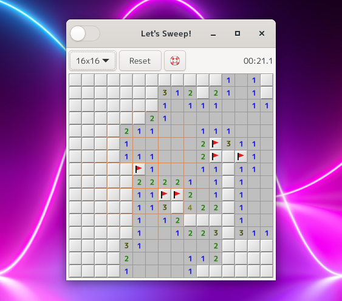

Aho-Sweeper
====================================================================================================
これと言って特徴のない超シンプルなデスクトップLinux向けマインスイーパーアプリ。
けっこうな頻度で解けないパターンが出るのでアホです。

インストール方法
----------------------------------------------------------------------------------------------------
### ビルド
コンパイルするには以下のパッケージのインストールが必要です。

* gtk3
* meson
* valac

コンパイル手順は以下になります。

1. プロジェクトのルートディレクトリで作業をします。

       $ meson --prefix=/usr/local build
	   $ cd build
	   $ ninja

2. 以下のコマンドでインストールします。

       $ sudo ninja install

### コンパイル済みファイルをダウンロードする
以下のGoogleドライブのリンクからコンパイル済み実行ファイルをダウンロードできます。

<https://drive.google.com/file/d/1skdtgHI0yT-lY6pimElt39Kpfa4aLp3x/view?usp=sharing>

MD5SUM: 488b31c9bfd5ecaccf676550aea65132
SHA256SUM: 86be9fdb954594ab3b811cba47a26ef92d07a722c8f3564414cb5ed3df8c32d4

実行権限を与えた上、おそらくアイコンをクリックしても実行できないので残念ですがコマンドラインから実行
してください。

----------------------------------------------------------------------------------------------------

Copyright (c) 2021 田中喬之

