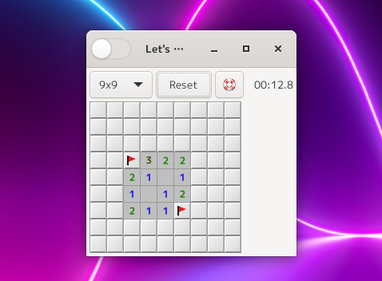
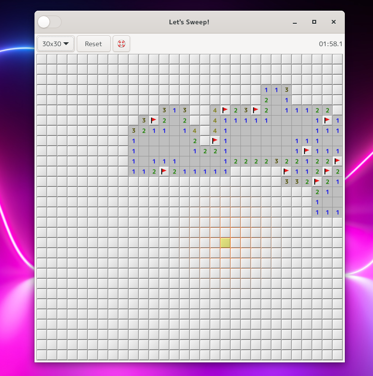
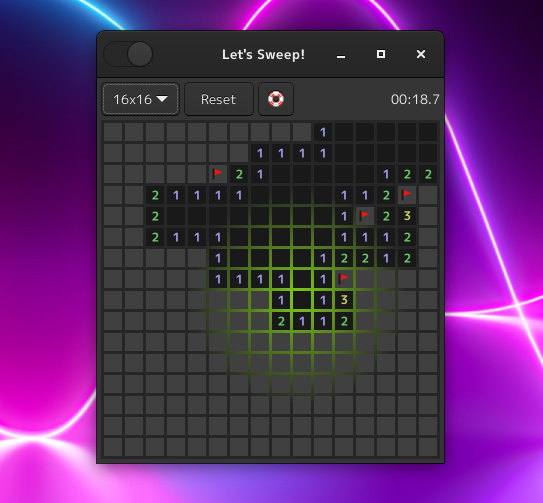

Aho-Sweeper
====================================================================================================
これと言って特徴のない超シンプルなデスクトップLinux向けマインスイーパーアプリ。
けっこうな頻度で解けないパターンが出るのでアホです。

### 3段階の難易度
#### 初心者向け

#### 経験者向け

#### 熟練者向け

### ダークモード
ダークモードはじめました。

非常に見にくくてイライラに耐えながらやるので難易度が高いという予想外のゲーム性が追加されました。

インストール方法
----------------------------------------------------------------------------------------------------
### ビルド
コンパイルするには以下のパッケージのインストールが必要です。

* gtk3
* meson
* valac

コンパイル手順は以下になります。

1. プロジェクトのルートディレクトリで作業をします。

       $ meson --prefix=/usr/local build
	   $ cd build
	   $ ninja

2. 以下のコマンドでインストールします。

       $ sudo ninja install

### 実行可能ファイル (AppImage) をダウンロードする
以下のGoogleドライブのリンクからAppImage形式の実行ファイルをダウンロードできます。

<https://drive.google.com/file/d/1t0b-71GozVJDaCHkOvnVnl013sr8iPAx/view?usp=sharing>

* MD5SUM: 9de2c7790624d8457355953f959f979e
* SHA256SUM: 3a980381484d88bcf7632675ca061054123a4f92daede50443c53a37fd7019a6

実行権限を与えた上、おそらくアイコンをクリックして起動してください。

### Flatpakでインストールする

Flatpakのマニフェストファイルも同梱したのでそちらを使ってもインストールできます。
ランタイムはorg.gnome.Platform/41とorg.gnome.Sdk/41で動作確認済みです。

### ランタイムのインストール方法
各ディストリビューションで指定された方法でflatpakとflatpak-builderをインストールしてください。
flatpakとflatpak-builderをインストールしたら下記のコマンドでランタイムをインストールします。

    $ flatpak remote-add flathub https://flathub.org/repo/flathub.flatpakrepo
	$ flatpak install flathub org.gnome.Platform
	$ flatpak install flathub org.gnome.Sdk

### FlatpakによるAho-Sweeperのインストール方法
このGitリポジトリの基底ディレクトリで実行してください。

	$ cd ./flatpak
	$ flatpak-builder --install --user --force-clean build com.github.aharotias2.aho-sweeper.yml

### Flatpakによる実行

    $ flatpak run com.github.aharotias2.aho-sweeper

または、アプリケーションメニューの「ゲーム」から選択してもできるはずです。

----------------------------------------------------------------------------------------------------

Copyright (c) 2021 田中喬之

